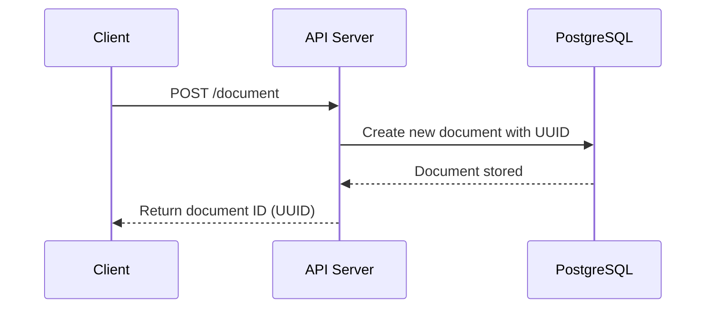
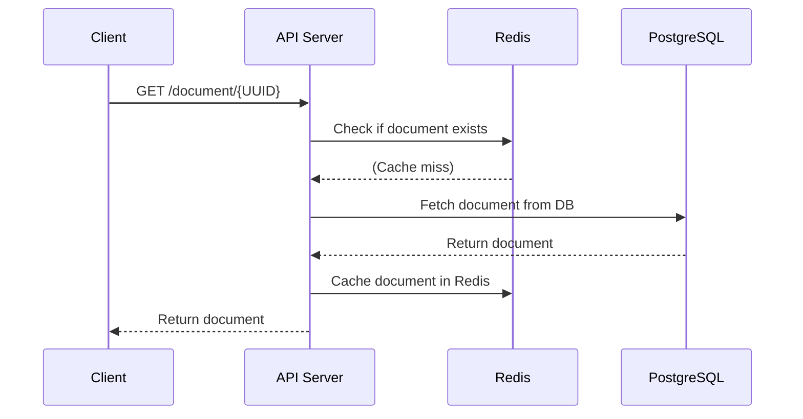

# Document API 시퀀스 다이어그램

## 📌 문서 생성

```mermaid
sequenceDiagram
    participant Client
    participant API Server
    participant PostgreSQL

    Client->>API Server: POST /document
    API Server->>PostgreSQL: Create new document with UUID
    PostgreSQL-->>API Server: Document stored
    API Server-->>Client: Return document ID (UUID)
```

## 📌 문서 조회

```mermaid
sequenceDiagram
    participant Client
    participant API Server
    participant Redis
    participant PostgreSQL

    Client->>API Server: GET /document/{UUID}
    API Server->>Redis: Check if document exists
    Redis-->>API Server: (Cache miss)
    API Server->>PostgreSQL: Fetch document from DB
    PostgreSQL-->>API Server: Return document
    API Server->>Redis: Cache document in Redis
    API Server-->>Client: Return document
```

